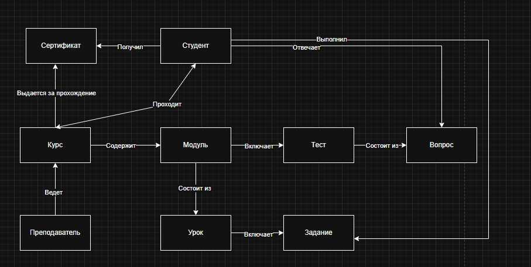
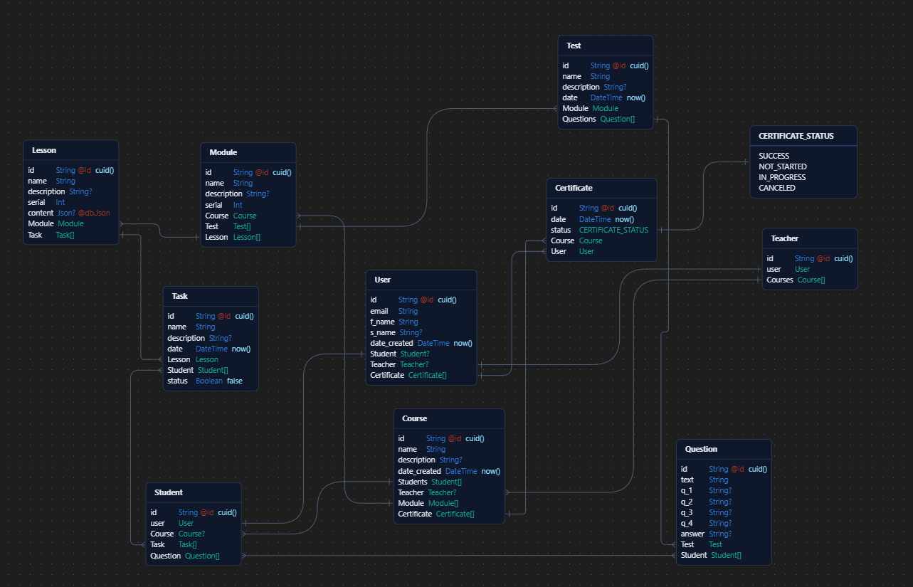
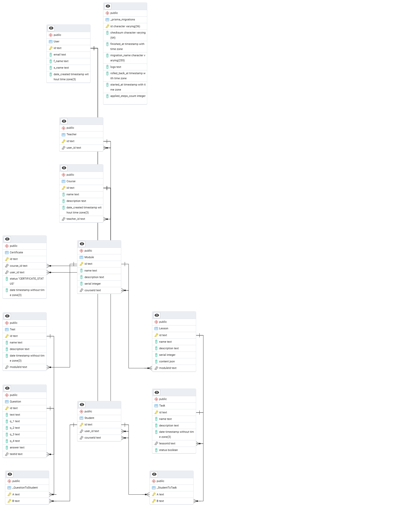

| Выполнил      | Группа | Выполнено | Дисциплина          |
| ------------- | ------ | --------- | ------------------- |
| Шевелёв Артём | P4150  | 13.03.25  | Взаимодействие с БД |

# Лабораторная работа 2

## **Задания**
1.  Из описания предметной области, полученной в ходе выполнения ЛР 1, выделить сущности, их атрибуты и связи, отразить их в инфологической модели (она же концептуальная)
2.  Составить даталогическую (она же ER-диаграмма, она же диаграмма сущность-связь) модель. При описании типов данных для атрибутов должны использоваться типы из СУБД PostgreSQL.
3.  Реализовать даталогическую модель в PostgreSQL. При описании и реализации даталогической модели должны учитываться ограничения целостности, которые характерны для полученной предметной области
4.  Заполнить созданные таблицы тестовыми данными. Для построения моделей можно использовать plantUML

## **Предметная область**
Данная предметная область охватывает систему управления онлайн-обучением . Система предназначена для организации образовательного процесса, управления курсами, пользователями, их прогрессом и взаимодействием. Система управления онлайн-обучением позволяет преподавателям создавать и управлять курсами, а студентам — проходить обучение, выполнять задания и получать сертификаты. Взаимосвязи между сущностями обеспечивают корректную работу образовательного процесса, отслеживание прогресса и управление контентом. 

## **Список сущностей и их классификация**

| Сущность                         | Классификация      | Описание                                                                   |
| -------------------------------- | ------------------ | -------------------------------------------------------------------------- |
| **Пользователь (`User`)**        | **Стержневая**     | Главная сущность, объединяющая студентов, преподавателей и администраторов |
| **Студент (`Student`)**          | **Характеристика** | Подтип пользователя, проходящий обучение                                   |
| **Преподаватель (`Instructor`)** | **Характеристика** | Подтип пользователя, создающий курсы и управляющий обучением               |
| **Курс (`Course`)**              | **Стержневая**     | Основная образовательная единица, содержащая модули, уроки и тесты         |
| **Модуль (`Module`)**            | **Стержневая**     | Часть курса, объединяющая несколько уроков                                 |
| **Урок (`Lesson`)**              | **Стержневая**     | Основной элемент обучения, содержащий материалы                            |
| **Задание (`Assignment`)**       | **Стержневая**     | Практическая работа, привязанная к уроку                                   |
| **Тест (`Quiz`)**                | **Стержневая**     | Проверка знаний в рамках курса                                             |
| **Вопрос (`Question`)**          | **Характеристика** | Вопрос, относящийся к тесту                                                |
| **Сертификат (`Certificate`)**   | **Стержневая**     | Подтверждение успешного прохождения курса                                  |

## **Концептуальная модель**

## **Логическая модель**

## **Физическая модель**

## SQL

[Миграция](../../prisma/migrations/20250320141032_init/migration.sql)

[Заполнение данными](../seed/initail.sql)